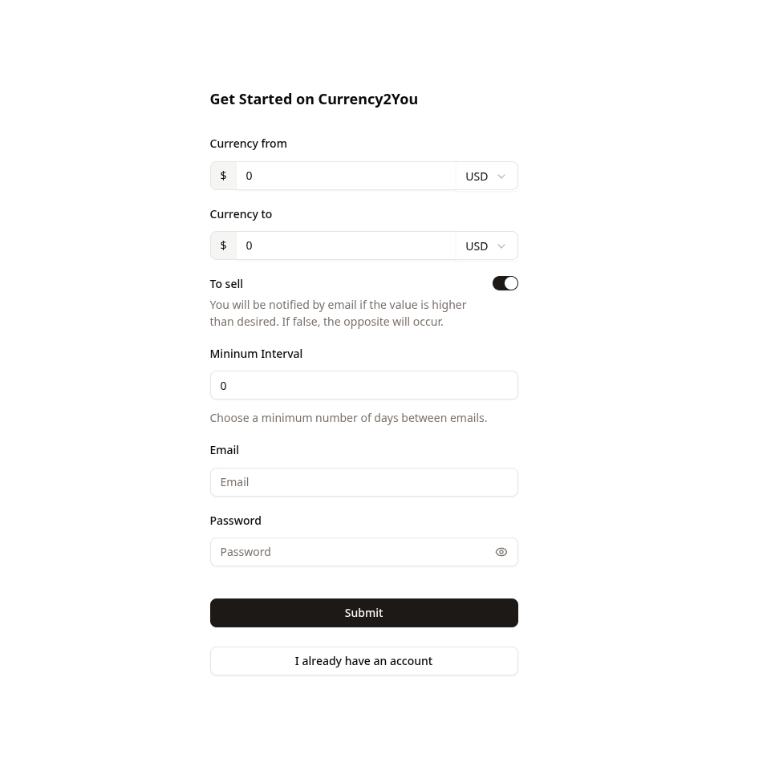

<!-- Improved compatibility of back to top link: See: https://github.com/othneildrew/Best-README-Template/pull/73 -->

<!--
*** Thanks for checking out the Best-README-Template. If you have a suggestion
*** that would make this better, please fork the repo and create a pull request
*** or simply open an issue with the tag "enhancement".
*** Don't forget to give the project a star!
*** Thanks again! Now go create something AMAZING! :D
-->

<!-- PROJECT SHIELDS -->
<!--
*** I'm using markdown "reference style" links for readability.
*** Reference links are enclosed in brackets [ ] instead of parentheses ( ).
*** See the bottom of this document for the declaration of the reference variables
*** for contributors-url, forks-url, etc. This is an optional, concise syntax you may use.
*** https://www.markdownguide.org/basic-syntax/#reference-style-links
-->

[![Contributors][contributors-shield]][contributors-url]
[![Forks][forks-shield]][forks-url]
[![Stargazers][stars-shield]][stars-url]
[![Issues][issues-shield]][issues-url]

[![MIT License][license-shield]][license-url]

[![LinkedIn][linkedin-shield]][linkedin-url]

<!-- PROJECT LOGO -->
 

  

<h3 align="center">Currency2U</h3>

  

    Receive insider information about monetary values
     
    <a href="https://github.com/henriqk0/currency-2-u"><strong>Explore the docs »</strong></a>
     
     
    <a href="https://currency-2-u.vercel.app/">View Application</a>
    ·
    <a href="mailto:henriquedeslima2811@gmail.com?subject=Currency2uBugReport">Report Bug</a>
    ·
    <a href="mailto:henriquedeslima2811@gmail.com?subject=Currency2uRequestFeature">Request Feature</a>
  

<!-- TABLE OF CONTENTS -->

  
Summary:

  <ol>
    <li>
      <a href="#about-the-project">About the Project</a>
      <ul>
        <li><a href="#built-with">Built with</a></li>
      </ul>
    </li>
    <li><a href="#usage">Usage</a></li>
    <li><a href="#contributing">Contributing</a></li>
    <!-- <li><a href="#license">License</a></li> -->
    <li><a href="#contact">Contact</a></li>
  </ol>

<!-- ABOUT THE PROJECT -->

## About the Project

This system provides a backend and responsive interface for users to register and log in to change their currency monitoring information.

Whenever the currency reaches the desired value set by the user, they will receive an email within the minimum interval they specified.

### Built with

- [![Express][Express.js]][Express-url]
- [![Next][Next.js]][Next-url]
- [![Docker][Docker.js]][Docker-url]
- [![MongoDB][MongoDB.js]][MongoDB-url]
- [![Redis][Redis.js]][Redis-url]
- [![TypeScript]][TypeScript-url]
- [![Tailwind][Tailwind.css]][TypeScript-url]

## Usage

First of all, you need register your account.

Assuming you want to monitor Bitcoin to buy when it reaches $70,000, the first input will be 1 and the button next to it will be set to BTC. The second input will be 70,000 and the button should remain set to USD.

The remaining inputs are explained in the image, while the email will be used to receive notifications and to log in if you want to change the previous information or delete your account.

## Contributing

Contributions are what make the open source community such an incredible place to learn, inspire, and create. Any contributions you make are **greatly appreciated**.

If you have a suggestion that could improve this, please fork the repository and create a pull request. You can also simply open an issue with the "improvement" tag.
Don't forget to give the project a star! Thanks again!

1. Fork the Project
2. Create your Feature Branch (`git checkout -b feat/AmazingFeature`)
3. Commit your changes (`git commit -m 'Add AmazingFeature'`)
4. Push to Branch (`git push origin feat/AmazingFeature`)
5. Open a Pull Request

## License

Distributed under the MIT License. See `LICENSE` for more information.

<!-- LICENSE -->
<!-- ## License

<!-- CONTACT -->

## Contact

Me: [linkedin-url]

Project: [github.com/henriqk0/currency-2-u](https://github.com/henriqk0/currency-2-u/tree/main)

<!-- MARKDOWN LINKS & IMAGES q  -->
<!-- https://www.markdownguide.org/basic-syntax/#reference-style-links -->

[Express-url]: https://expressjs.com/
[Express.js]: https://img.shields.io/badge/Express-000000?logo=express&logoColor=white
[TypeScript-url]: https://www.typescriptlang.org/
[TypeScript]: https://img.shields.io/static/v1?style=for-the-badge&message=TypeScript&color=3178C6&logo=TypeScript&logoColor=FFFFFF&label=
[Next-url]: https://nextjs.org/
[Next.js]: https://img.shields.io/badge/next.js-000000?style=for-the-badge&logo=nextdotjs&logoColor=white
[Tailwind-url]: https://tailwindcss.com/
[Tailwind.css]: https://img.shields.io/static/v1?style=for-the-badge&message=Tailwind%20CSS&color=06B6D4&logo=Tailwind-CSS&logoColor=FFFFFF&label=
[MongoDB-url]: https://www.mongodb.com/
[MongoDB.js]: https://img.shields.io/badge/-MongoDB-13aa52?style=for-the-badge&logo=mongodb&logoColor=white
[Redis-url]: https://redis.io
[Redis.js]: https://img.shields.io/badge/Redis-DC382D?style=for-the-badge&logo=redis&logoColor=white
[Docker-url]: https://www.docker.com/
[Docker.js]: https://img.shields.io/static/v1?style=for-the-badge&message=Docker&color=2496ED&logo=Docker&logoColor=FFFFFF&label=
[contributors-shield]: https://img.shields.io/github/contributors/henriqk0/currency-2-u.svg?style=for-the-badge
[contributors-url]: https://github.com/henriqk0/currency-2-u/graphs/contributors
[forks-shield]: https://img.shields.io/github/forks/henriqk0/currency-2-u.svg?style=for-the-badge
[forks-url]: https://github.com/henriqk0/currency-2-u/network/members
[stars-shield]: https://img.shields.io/github/stars/henriqk0/currency-2-u.svg?style=for-the-badge
[stars-url]: https://github.com/henriqk0/currency-2-u/stargazers
[issues-shield]: https://img.shields.io/github/issues/henriqk0/currency-2-u.svg?style=for-the-badge
[issues-url]: https://github.com/henriqk0/currency-2-u/issues
[license-shield]: https://img.shields.io/github/license/henriqk0/currency-2-u.svg?style=for-the-badge
[license-url]: https://github.com/henriqk0/currency-2-u/blob/main/LICENSE
[linkedin-shield]: https://img.shields.io/badge/-LinkedIn-black.svg?style=for-the-badge&logo=linkedin&colorB=555
[linkedin-url]: https://www.linkedin.com/in/henriqdeslima/
